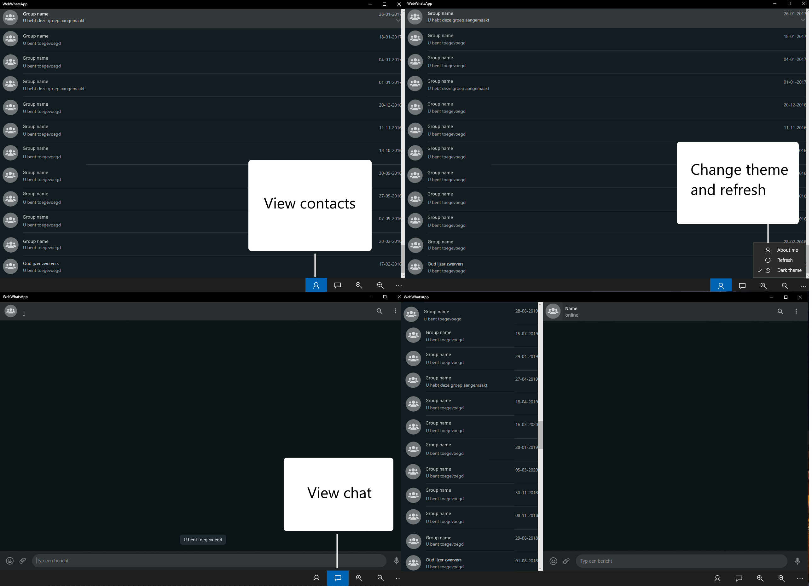

# WindowsPhone_WebWhatsApp
Get WebWhatsapp on your Windows 10 Mobile / X86 / X64 device.

# Description
WebWhatsApp is a simple application to run WhatsApp Web on your Windows 10 Mobile device. A custom User Agent is set, so WhatsApp Web is able to load on mobile. There are a few bugs present on the W10 Mobile platform, but you can send text messages!   

# Installation
The .appx is included in the project files. You can download the ARM for W10 Mobile, and the X86 / X64 for a desktop pc.

You might need to install the included certificate. Walk through the installation (right mouse button --> install) and store it into the "Trusted People" archive, installing it automatically might not be sufficient. 

# Overview

